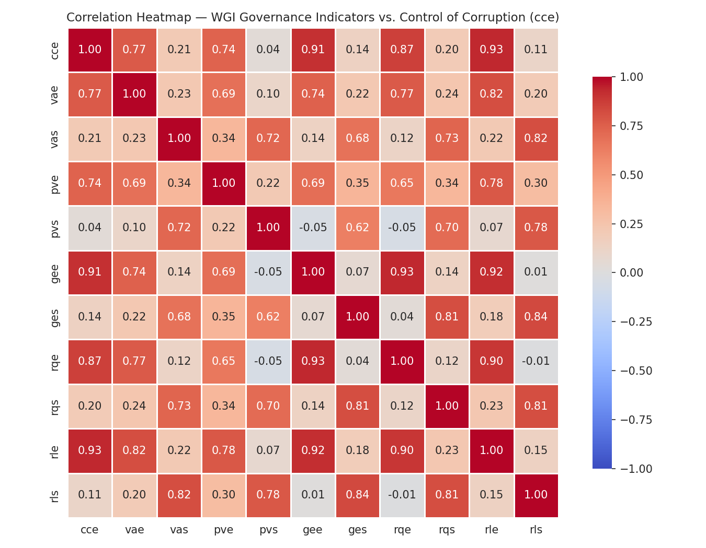
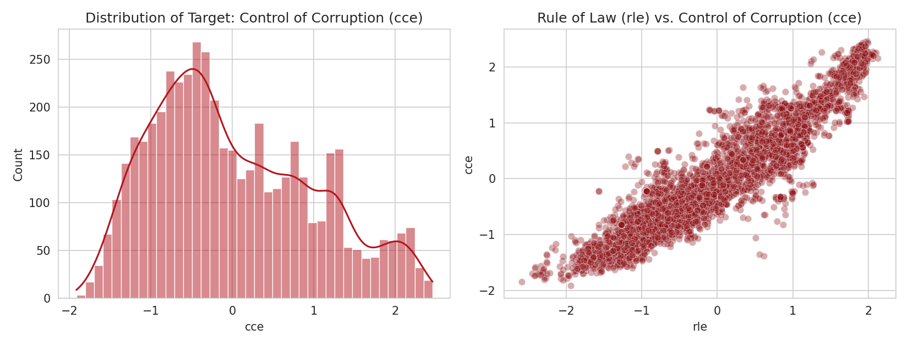

# GovRisk AI — Control of Corruption Prediction

## Mission & Problem

Investors, donors, and policy analysts need a fast way to gauge a country's institutional risk, but full governance audits are slow and expert-dependent.
GovRisk AI predicts the World Bank's **Control of Corruption** estimate (`cce`) for a country-year directly from its other Worldwide Governance Indicators.
This turns a slow expert review into a near-instant, data-driven risk signal.

## Dataset

[World Bank Worldwide Governance Indicators (WGI)](https://www.kaggle.com/datasets/cvengr/government-corruption-data-of-180-countries)
— 180 countries/territories, 1996–2021 (annual from 2002 onward), ~4,900 rows after cleaning, 6
governance dimensions each reported as an estimate + standard error. Full column dictionary and
methodology notes are in the notebook header and
[`wgidataset_readme.pdf`](<summative/linear_regression/Corruption Indicator Data of 180 Governments/wgidataset_readme.pdf>).

### Visualizations

<table>
<tr><td>



</td></tr>
</table>

`rle` (Rule of Law), `gee` (Government Effectiveness), and `rqe` (Regulatory Quality) all correlate
with `cce` at **r ≈ 0.87–0.94** — the strongest signal in the dataset, and the reason all three
survive as top features in every model below despite moderate multicollinearity (VIF ≈ 9–13).



`cce` is roughly normal and centered near 0 (the WGI scale runs about −2.5 to +2.5), and its
relationship with `rle` is visibly linear with mild heteroscedasticity at the extremes — evidence
that a linear model is a reasonable fit, while a tree-based model can still pick up the edge-case
curvature.

## Model Comparison

Trained and evaluated in
[`summative/linear_regression/wgi_corruption_linear_regression.ipynb`](summative/linear_regression/wgi_corruption_linear_regression.ipynb):

| Model | Train RMSE | Test RMSE | Train MAE | Test MAE | Train R² | Test R² |
|---|---|---|---|---|---|---|
| OLS Linear Regression | 0.326 | 0.319 | 0.263 | 0.254 | 89.17% | 89.24% |
| SGD Regressor (gradient descent) | 0.327 | 0.319 | 0.263 | 0.254 | 89.17% | 89.26% |
| Decision Tree | 0.073 | 0.261 | 0.034 | 0.175 | 99.46% | 92.78% |
| **Random Forest (best)** | 0.076 | **0.203** | 0.054 | **0.144** | 99.41% | **95.63%** |

**Random Forest** was saved as the production model (`model.pkl` / `scaler.pkl`) — lowest test RMSE
and highest test R² of the four, and its train/test gap is far smaller than the single Decision
Tree's, meaning it generalizes rather than memorizing. The two linear models (OLS, SGD) land within
noise of each other, confirming gradient descent converged to essentially the same optimum as the
closed-form solution; both are ~6 points of R² behind Random Forest because the `rle`/`cce`
relationship has mild curvature a straight line can't capture.

## Repository Structure

```
.
├── README.md
├── pyproject.toml, uv.lock, .python-version   # uv-managed environment (repo root)
├── requirements.txt                            # exported for pip-only platforms (Render)
└── summative/
    ├── linear_regression/
    │   ├── wgi_corruption_linear_regression.ipynb
    │   ├── model.pkl, scaler.pkl               # produced by the notebook
    │   ├── wgi_corruption_{train,test}_data.csv
    │   ├── images/                             # visualizations used above
    │   └── Corruption Indicator Data of 180 Governments/   # raw dataset + readme
    ├── api/
    │   ├── main.py                             # FastAPI app, CORS middleware
    │   ├── schema/                             # Pydantic request/response models
    │   ├── router/                             # HTTP route handlers
    │   ├── service/                            # model loading, prediction, retraining
    │   └── data/incoming/                      # uploaded retrain CSVs (gitignored)
    └── FlutterApp/                             # mobile app (see below)
```

## Setup (uv)

From the repo root:

```bash
uv sync
```

Or with plain pip: `pip install -r requirements.txt`.

## Running the API locally

```bash
uv run uvicorn api.main:app --app-dir summative --reload
```

Then open **http://127.0.0.1:8000/docs** for the local Swagger UI.

## Public API (deployed)

- **Base URL:** https://regression-analysis-mobile-application-om0i.onrender.com
- **Swagger UI:** https://regression-analysis-mobile-application-om0i.onrender.com/docs

| Method | Path | Description |
|---|---|---|
| GET | `/health` | Liveness check |
| POST | `/predict` | Predicts `cce` from the 10 WGI features |
| POST | `/retrain` | Uploads a CSV of new labelled rows, retrains in the background |
| GET | `/retrain/{job_id}` | Polls the status/metrics of a retraining job |

`POST /predict` takes all 10 predictors as required, range-validated floats (Pydantic `Field(ge=..., le=...)`):
`vae`, `vas`, `pve`, `pvs`, `gee`, `ges`, `rqe`, `rqs`, `rle`, `rls` (estimate columns: −3.5 to 3.5;
standard-error columns: 0.0 to 1.5 — bounds derived from the real training-data range with headroom).
Out-of-range or missing values are rejected with `422` before reaching the model. Response:

```json
{ "control_of_corruption": 0.4256, "model_name": "Random Forest Regressor" }
```

`POST /retrain` accepts a multipart CSV upload (field name `file`, same columns as the predictors
plus `cce`), merges it with the existing training data, and re-fits `StandardScaler` +
`RandomForestRegressor` as a **FastAPI `BackgroundTask`** — the request returns a `202` and a
`job_id` immediately; poll `GET /retrain/{job_id}` for `queued` → `running` → `completed`/`failed`
and the resulting metrics. Once `completed`, `/predict` is already serving the retrained model.

### CORS

Configured in `summative/api/main.py` via `CORSMiddleware`, with `allow_credentials=False` (this
API has no cookies/session auth), `allow_methods=["GET", "POST"]` (only the verbs the API exposes),
and `allow_headers=["Content-Type", "Authorization"]` (`Content-Type` for JSON/multipart bodies,
`Authorization` reserved for future token auth on `/retrain`).

## Mobile App

Flutter single-screen app in `summative/FlutterApp/`: 10 input fields (one per WGI predictor,
grouped as estimates + standard errors), a **Predict** button, and a result panel that shows the
predicted `cce` or a validation/network error. It calls the deployed API above via
`summative/FlutterApp/lib/api_service.dart`.

To run it:

```bash
cd summative/FlutterApp
flutter pub get
flutter run          # pick a connected physical device or emulator when prompted
```

(Grading requires the **mobile** app, not the Flutter web target — run on an Android/iOS
device or emulator, e.g. `flutter run -d <device-id>` from `flutter devices`.)

## Video Demo

[YouTube demo (≤7 min)](TODO-add-youtube-link) — TODO: add the link once recorded.
